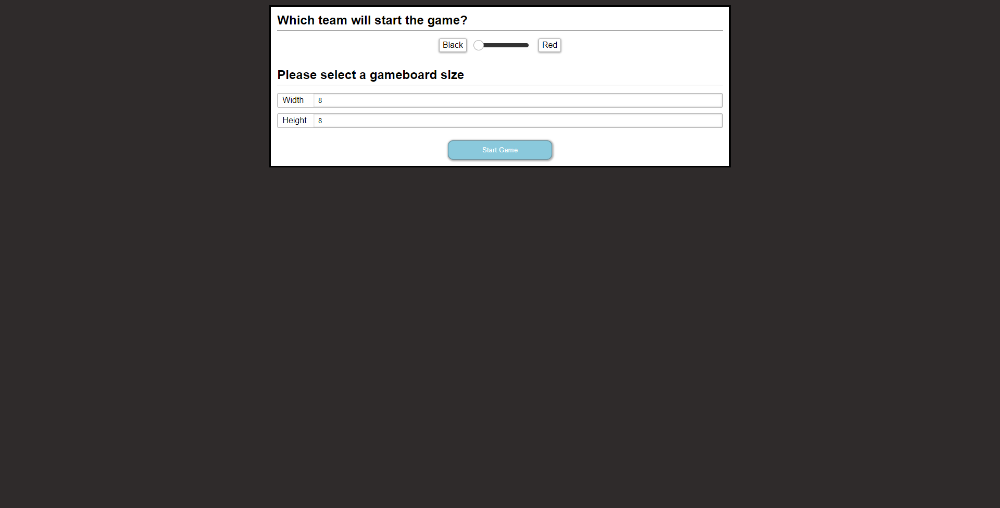
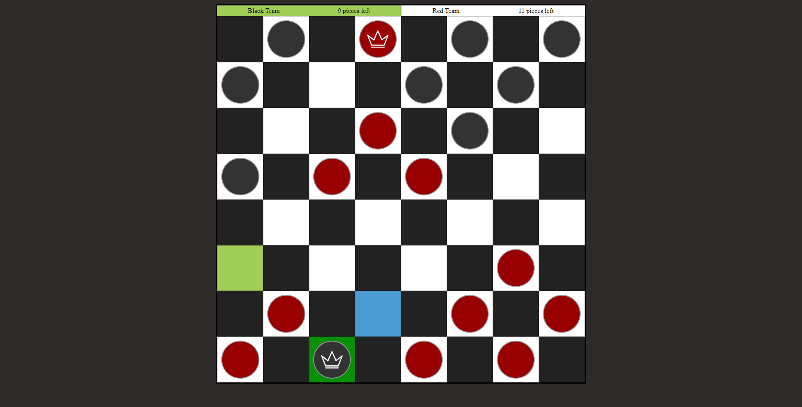
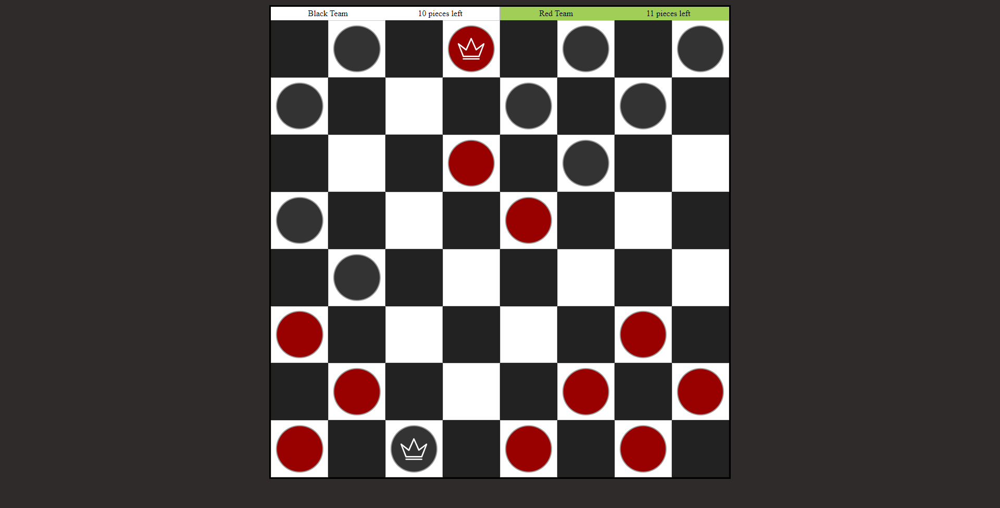
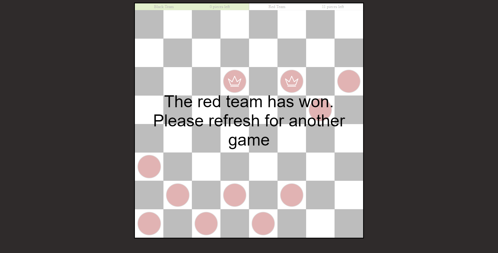

## One Day Checkers Build

[Click here to play on GitHub Pages](https://iburn36360.github.io/one-day-checkers/)

### Known issues
- You can get the game into a state where no one can move and no one can win.  While there are rules for that, they are not currently implemented.
- This won't work on old browsers.
- There are cases, on small screens, where the pieces could be difficult to interact with.

### Screenshots:

